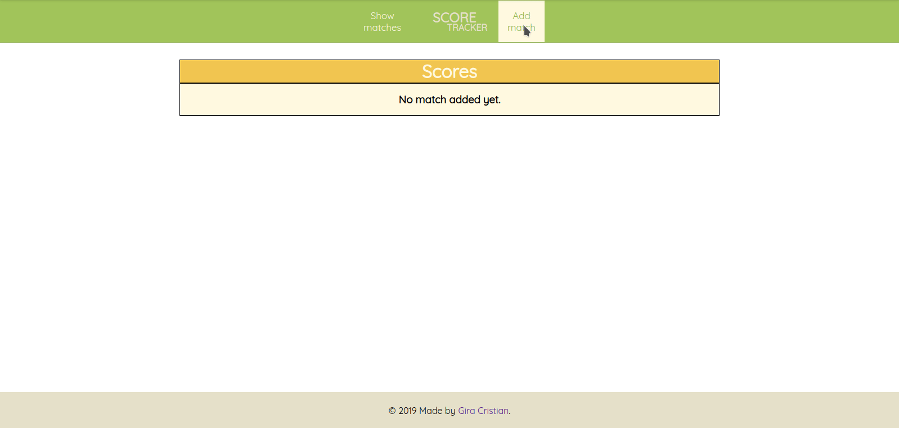

# Score-Tracker

Score-Tracker is a minimal platform dedicated to keep track of soccer matches played between
two players. It has been built using the following technologies:

- **NodeJS** for building the REST API backend
- **VueJS** as a frontend framework for client
- **MySQL** as the storage 
- **Docker & docker-compose** on the infrastructure for communication between all services

### Features 

- Add a match 
- Show all matches

### Prerequisites

- Docker >= 18.09.6
- docker-compose >= 1.25.0

### Installation

- Clone the repository and and `cd` into it 

```
$ git clone git@github.com:cr1g/score-tracker-v1.git
$ cd score-tracker-v1
```

- Start the application using docker-compose

```
$ docker-compose up --build -d
```

- Open `http://localhost:8080` on your browser

### Demo

